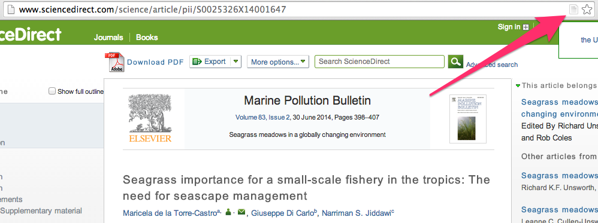
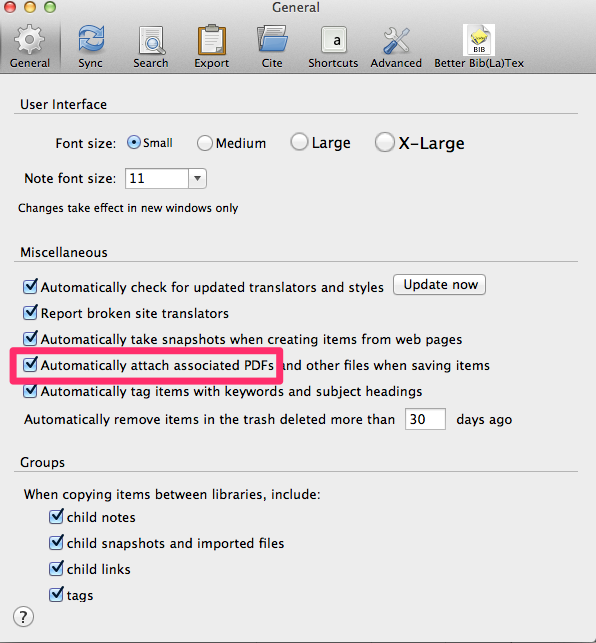
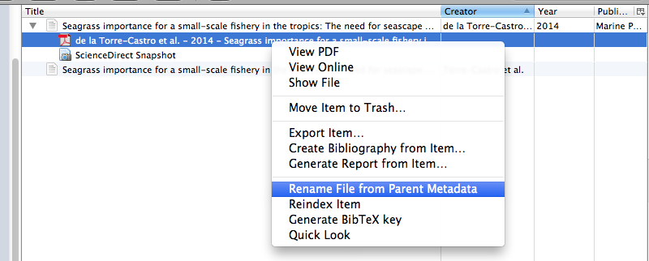
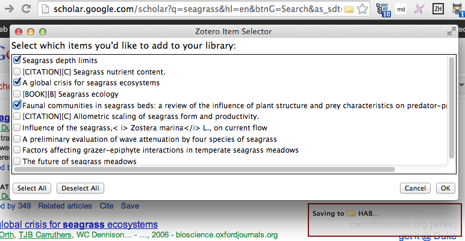
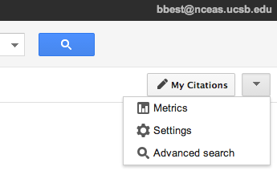
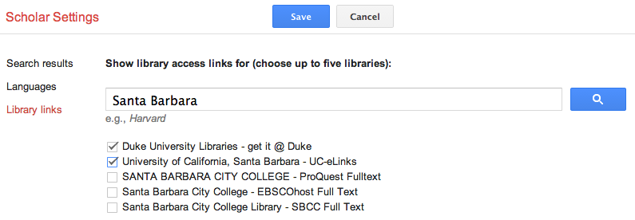

# Writing with Rmarkdown

We can create versioned (ie in Github), live (ie output directly from data with R), documents in various formats (ie pdf, html, docx) with formatting, figures, tables, equations and references. All using [Rmarkdown](http://rmarkdown.rstudio.com). This is in the vein of generating truly reproducible research.

## Example

Here's an example of using a single Rmarkdown file [test.**Rmd**](./test.Rmd) and rendering it in the following formats:

- [test.**pdf**](./test.pdf?raw=true). Portable document format for pretty professional output.

- [test.**docx**](./test.docx?raw=true). Microsoft Word doc for sharing with collaborators who can use Track Changes for providing feedback.

- [test.**html**](https://rawgit.com/bbest/rmarkdown-example/master/test.html). All you need is a web browser to view this. Works well with linking out to source of References via DOI and links within document. Since Github doesn't natively show HTML, you'll need to right-click on link, Save Link as... to download and open from your computer.

- [test.**md**](./test.md). Great for tracking changes in Github (ie [rendered differences](https://github.com/bbest/rmarkdown-example/commit/4cfcbe626dfa0df5238872820169198fd2008401?short_path=574f1d9#diff-4)) and figuring out who changed what when (ie [blame](https://github.com/bbest/rmarkdown-example/blame/master/test.md)). Equations maintain their latex format, so not prettily rendered like other formats.

You can variously render different formats in RStudio and set options in the metadata header.

  

Check out [test.Rmd differences](https://github.com/bbest/rmarkdown-example/commits/master/test.Rmd) between commits as it gets built up:

1. [Initial](https://github.com/bbest/rmarkdown-example/commit/7d416b2adba1d49746d8e61b1f3cd53e89548784#diff-2). In RStudio, File > New File > R Markdown ...

1. [Add table of contents & bibliography](https://github.com/bbest/rmarkdown-example/commit/572559a1443cc285bba7b44f6d2a4b96e871069e#diff-1)

  ```
 output:
   html_document:
     toc: true
     number_sections: true
 bibliography: test.bib
 csl: apa.csl
 ---
  ```

  ...

  The Ocean Health Index [@halpern_index_2012; @selig_assessing_2013] derives most of its pressures from Halpern et al. [-@halpern_global_2008].

1. [Add equation](https://github.com/bbest/rmarkdown-example/commit/4c33f8ad0d5056714c6e72c433523c57e0f3fb4f#diff-0)

  ```
  $$
  x_{FIS} =  (\prod_{g=1}^{6} SS_{i,g}^{C_{i,g}})^\frac{1}{\sum{C_{i,g}}}
  $$ 
  ```

1. [Add format options for pdf and docx](https://github.com/bbest/rmarkdown-example/commit/437e9f1436faaaa431b4f736cd2df21731125b5f#diff-0)

  ```
  output:
    pdf_document:
      fig_caption: yes
      number_sections: yes
      toc: yes
    word_document:
      fig_caption: yes
  ```

1. [Add github markdown](https://github.com/bbest/rmarkdown-example/commit/c3e428e781f8b505feedc0d97b33080ed59067f6#diff-0)

  ```
  output:
    md_document:
      variant: markdown_github
  ```

1. [Add OHI figure, pretty table and inline values](https://github.com/bbest/rmarkdown-example/compare/c3e428e...02897c2#diff-4)

  ```
  Hats off to the top scoring region of **`r filter(d, goal=='Index') %>% head(1) %>% select(region_label)`** 
  with a score of `r filter(d, goal=='Index') %>% head(1) %>% select(score)`! Here are the top 10 scoring 
  regions of `r n_distinct(d$region_label) - 1 # remove GLOBAL` globally:
  ```
  
  ```
  {r top10, echo=FALSE, results='asis'}
  kable(
    d %>%
      filter(region_label != 'GLOBAL' & goal=='Index') %>%
      head(10) %>%
      select(
        Region = region_label,
        Score  = score),
    format='pandoc', caption='Top 10 scoring regions.')
  ```


## Software

Here are the key pieces of software:

- [**RStudio**](http://www.rstudio.com/): excellent free, cross-platform R integrated development environment for writing code and text.

- [**Rmarkdown**](http://rmarkdown.rstudio.com): versatile "literate programming" R package for weaving chunks of R code with formatted text (markdown), built into RStudio.

- [**Pandoc**](johnmacfarlane.net/pandoc): the standalone conversion engine used by the rmarkdown package, comes bundled inside rmarkdown package.

- [**Zotero**](https://www.zotero.org): excellent free bibliographic management software, like Endnote. I can simply drag and drop from a Zotero collection to get the inline citation and pandoc will later generate the full bibliography at the end of the document.  To get this to work, after installing Zotero:

  - Install [Zotero Better Bibtex](https://github.com/ZotPlus/zotero-better-bibtex)
  
  - In Zotero Preferences, set:
  
    1. Export: "Default Output Format" to `Pandoc citation`
    
    1. Better Bib(La)tex: "Citation key format" to `[auth:lower]_[veryshorttitle:lower]_[year]`
    
## Process

After installing RStudio and Zotero, here are the steps for adding citations and generating a bibliography. You can use citation styles from any journal (*.csl files available for preview and download at [zotero.org/styles](https://zotero.org/styles)).

1. **New Rmd**. In RStudio, File > New File > R Markdown... and choose type and format, eg document, HTML document. This will generate a sample *.Rmd file with metadata header specifying default output format (eg `output: html_document`).

  

1. **Gather references**. In Zotero, place all references used for the paper into its own dedicated collection (eg "test").

  
    
1. **Add references**. Drag and drop references from this collection into the document editor (I like RStudio or [Sublime](http://www.sublimetext.com)). This will add a text citation, eg `@halpern_index_2012`.
  
1. **Export references**. Right-click on Zotero collection > Export Collection and choose `Better BibTex` and export to a file in the same folder as the *.Rmd (eg `test.bib`).

1. **Render**. You can render the document as you write with the 'Knit' button (or Ctrl+Shift+Y of [RStudio shortcuts](https://support.rstudio.com/hc/en-us/articles/200711853-Keyboard-Shortcuts)). You can specify one ore more formats in the metadata `output:` option to one of: `pdf_document`, `html_document`, `word_document`, `md_document`, `ioslides_presentation` and more. The top format will render by default. Or you can use `rmarkdown::render` at the console to specify format like so:

  ```r
  render("test.Rmd", "pdf_document")`
  ```

  The bibliography is automatically added to the end. See [rmarkdown.rstudio.com](http://rmarkdown.rstudio.com) and [pandoc citations](http://johnmacfarlane.net/pandoc/demo/example19/Citations.html) for details.
      
1. **Repeat**. Repeat as you write.
  
_Aside_. It is possible to sync your entire Zotero library using [AutoZotBib](http://www.rtwilson.com/academic/autozotbib), but my library is too large to practically use this.

_Note_. Besides the \*.Rmd and \*.md files, the outputs are binary in format and therefore just bloat the repository without adding novel information. Simply add entries like `*.pdf` and `*.docx` and `*.html` to [.gitignore](./.gitignore) to prevent these files from being tracked and uploaded to the github repository.

_More_. For a deeper example of customization with figure/ table numbering, check out [bbest/dissertation](http://github.com/bbest/dissertation).

## Zotero Tips

- Be sure to also install a [**Zotero web browser extension**](https://www.zotero.org/download), aka Zotero "connector"", so you can easily pull a reference being browsed into the already selected Zotero folder with the single click of the icon in the right hand side of the address bar. I've had great success with the Chrome connector.

    

- In the Preferences... General tab, I also like to tick the box to "Automatically attach associated PDFs...".

    

- For automatically downloaded PDFs, right-click on the PDF and "Rename File from Parent Metadata".

    

## Google Scholar Tips

- The Zotero web browser extension also works great with Google Scholar. You get a folder icon from search results allowing you to tick and save many references at once. 

    

- I like making a Chrome shortcut so I simply type "s " in the address bar and it gives me a prompt to search Google Scholar.

    

- Finally, when using Google Scholar, be sure to go into the Settings and And add UCSB to provide journal access to full articles.

    

    
    
## Bibliography

We can use this or another Zotero group library to sync references:

  [zotero.org/groups/ohi](https://www.zotero.org/groups/ohi/items)

You just need to send bbest your Zotero username after you [register](https://www.zotero.org/user/register/). Membership is private, and currently viewing is public. This shows up in the Zotero app separately from your private library under "Group Libraries".
