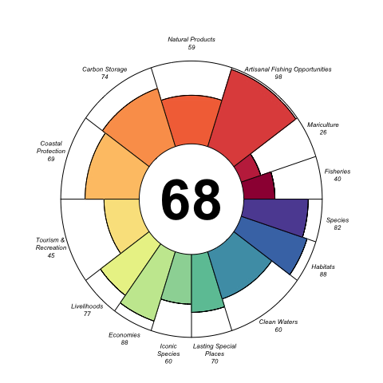

Introduction
------------

The Ocean Health Index (Halpern et al., 2012; Selig et al., 2013) derives most of its pressures from Halpern et al. (2008)...

Food Provision: Fisheries
-------------------------

Amount of sustainable wild-caught seafood compared to the max sustainable

\[
x_{FIS} =  (\prod_{g=1}^{6} SS_{i,g}^{C_{i,g}})^\frac{1}{\sum{C_{i,g}}}
\]

Variables:

-   \(SS\): stock status score, based on B/Bmsy and an underharvest penalty adjustment
-   \(C\): total catch
-   \(i\): OHI reporting region
-   \(g\): level of taxonomic grouping (ISSCAAP)</small>

Results
-------

Hats off to the top scoring region of **Heard and McDonald Islands** with a score of 90.29! Here are the top 10 scoring regions of 221 globally:

|Region|Score|
|:-----|----:|
|Heard and McDonald Islands|90.29|
|Ile Europa|89.48|
|Bassas da India|88.17|
|Howland Island and Baker Island|85.89|
|Juan de Nova Island|83.84|
|Glorioso Islands|83.79|
|Kerguelen Islands|82.84|
|Northern Saint-Martin|82.58|
|Nauru|82.18|
|Seychelles|81.93|

Please see Figure 1 to see how the breakdown of goal values for the global average.

Note that the `echo = FALSE` parameter was added to the code chunk to prevent printing of the R code that generated the plot.

Github Markdown
---------------

To get github friendly Markdown document for cleanly tracking changes to document in Github, put the following output first:

    output:
      md_document:
        variant: "markdown_github"

NOTE: You need to run this **LAST** though, since knitting other formats wipes out the `test_files` directory. To return to the Knit button having other options (HTML, PDF, Word), move this output type below the first option.

References
----------

<!-- placeholder for References in toc -->

Halpern, B. S., Longo, C., Hardy, D., McLeod, K. L., Samhouri, J. F., Katona, S. K., … Zeller, D. (2012). An index to assess the health and benefits of the global ocean. *Nature*. doi:[10.1038/nature11397](http://dx.doi.org/10.1038/nature11397)

Halpern, B. S., Walbridge, S., Selkoe, K. A., Kappel, C. V., Micheli, F., D’Agrosa, C., … Watson, R. (2008). A Global Map of Human Impact on Marine Ecosystems. *Science*, *319*(5865), 948–952. doi:[10.1126/science.1149345](http://dx.doi.org/10.1126/science.1149345)

Selig, E. R., Longo, C., Halpern, B. S., Best, B. D., Hardy, D., Elfes, C. T., … Katona, S. K. (2013). Assessing Global Marine Biodiversity Status within a Coupled Socio-Ecological Perspective. *PLoS ONE*, *8*(4), e60284. doi:[10.1371/journal.pone.0060284](http://dx.doi.org/10.1371/journal.pone.0060284)
